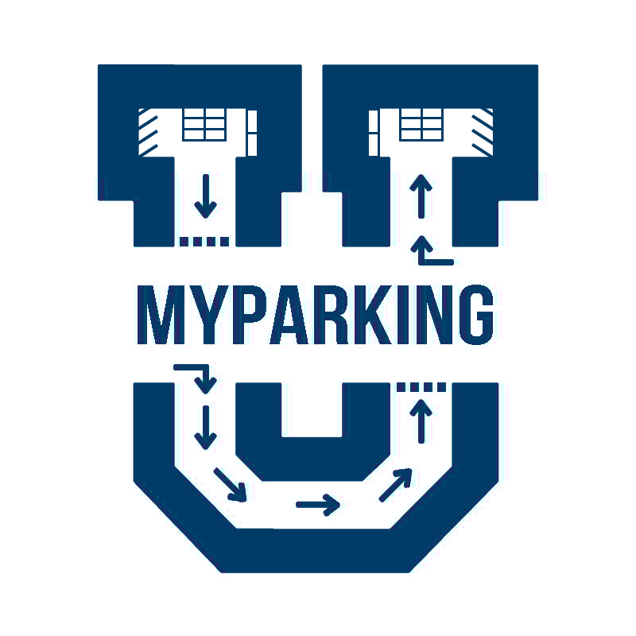
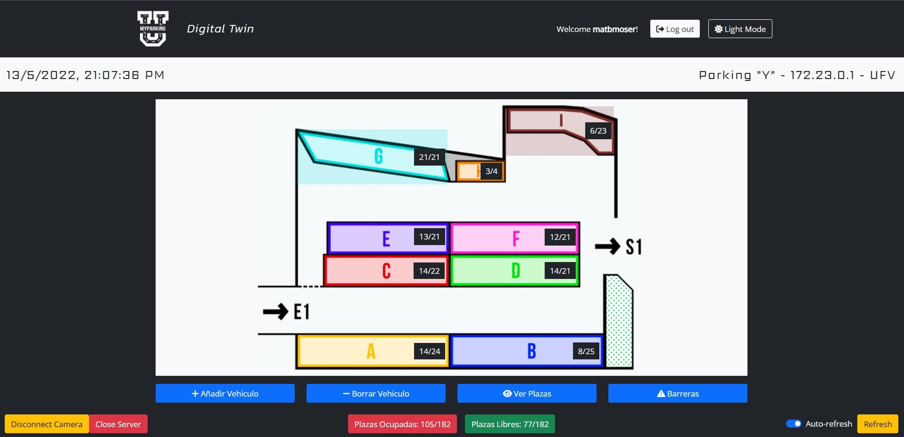
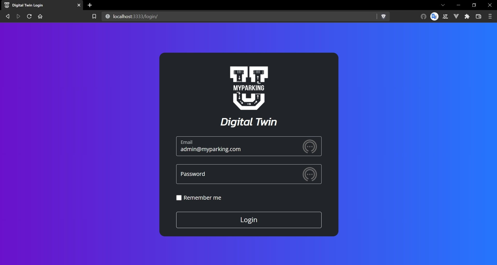

<div id="top"></div>

[![Contributors][contributors-shield]][contributors-url]
[![Forks][forks-shield]][forks-url]
[![Tags][tags-shield]][tags-url]
[![Issues][issues-shield]][issues-url]
[![MIT License][license-shield]][license-url]
[![LinkedIn][linkedin-shield]][linkedin-url]


<!-- PROJECT LOGO -->
<br />
<div align="center">
  <a href="https://github.com/matbmoser/SOTA">
    
  </a>
  <h1 align="center">Sistema de Optimización de Tiempo de Aparcamiento (SOTA)</h1>
  <h2 align="Left">Parking Time Optimization System (PTOS)</h2>

  <p align="justify">
    PTOS or SOTA (in Spanish) is a Smart Parking integrated system that offers a safe live view to managers and users of a Smart Campus Parking Lot. The system is capable of handling the detection of a licence plate by a IP Camera at the entrance of a parking lot and asign to registered users a parking place with a unique ticket.
    <br><br>
    Users are able to interact with the system in a Web Aplication called UFV MyParking. There can to add vehicles that will be detected by the cameras in the parking lot entrance and exits. They are also able to visualize the parking lot capacity and status
    <br><br>
    Once a user enterers a ticket will be generated indicating the asigned parking place. This asigned place is the one that best suits the type of vehicle configured in the WebApp.
    <br >
    </p>
    <a href="https://github.com/matbmoser/SOTA"><strong>Explore the docs »</strong></a>
    <br >
    <br >
    <a href="https://github.com/matbmoser/SOTA">View Demo</a>
    ·
    <a href="https://github.com/matbmoser/SOTA/issues">Report Bug</a>
    ·
    <a href="https://github.com/matbmoser/SOTA/issues">Request Feature</a>
</div>

<!-- TABLE OF CONTENTS -->
<details>
  <summary>Table of Contents</summary>
  <ol>
    <li>
      <a href="#about-the-project">About The Project</a>
      <ul>
        <li><a href="#built-with">Built With</a></li>
      </ul>
    </li>
    <li>
      <a href="#getting-started">Getting Started</a>
      <ul>
        <li><a href="#prerequisites">Prerequisites</a></li>
        <li><a href="#installation">Installation</a></li>
      </ul>
    </li>
    <li><a href="#license">License</a></li>
    <li><a href="#contact">Contact</a></li>
    <li><a href="#acknowledgments">Acknowledgments</a></li>
  </ol>
</details>

<br>
<hr>

## Integrated Systems:
<br>

<div style="font-size:1.5em">


  1. <strong>Digital Twin</strong> (Parking Administration Platform and Simulator)

  2. <strong>DeviceManager</strong> (Simulated IP Cameras Manager Server)

  3. <strong>UFV MyParking WebApp</strong> (Vehicle and User Platform)
  
  
</div>

<hr>
<br>

> ## Digital Twin ScreenShot
<br>

<br>

<br>

> ## UFV MyParking WebApp ScreenShot
<br>

<br>
<br>

> ## Virtual Tickets 

<br>

<br>


<br>
<br>

# Important

If you want to deploy the system in your local machine, you must have a linux (unix) enviroment, we recommend the use of  ```Git Bash``` to be able to execute the ```buildDocker.sh``` script and deploy the system into container using ```docker-compose```


> ## Built With

* [PHP 8.1](https://www.php.net/distributions/php-8.1.6.tar.gz)
* [Docker](https://www.docker.com/)
* [Docker Compose](https://docs.docker.com/compose/install/)
* [Laravel 9](https://laravel.com/docs/9.x/releases)
* [Vue.js 3](https://vuejs.org/)
* [Prime Vue](https://www.primefaces.org/primevue/)
* [Python 3.10](https://www.python.org/downloads/)
* [Composer](https://getcomposer.org/)
* [npm](https://www.npmjs.com/)


> ## Technology arquitecture

<br>

<br>

<p align="right">(<a href="#top">back to top</a>)</p>


<!-- GETTING STARTED -->
# Getting Started

You need to install ```Git``` or ``` GitBash``` to be able to handle the scripts used by the system. Despite of that you will need to install ```Docker``` in your local machine. The system has the docker files configured and waiting for being mounted.

## Prerequisites

## For Windows 

For the installation of the system you will need:

### Install Git with Gitbash

```
https://gitforwindows.org/
```
> **_NOTE:_** If you already have a virtualizated linux bash shell, like cygwin, please make sure you can execute .sh scripts.

### Install Docker:
> **_NOTE:_**  Please check the system requirements to successfullu install docker

- Link for Windows 
https://docs.docker.com/desktop/windows/install/

- Link for Mac:
https://docs.docker.com/desktop/mac/install/

- Link for Linux:
https://docs.docker.com/desktop/linux/install/


### Use a Web Browser

Both ```Digital Twin``` and ```UFV MyParking``` systems make use of the browser to interact with the users. So make sure that you have a updated browser like Google Chrome, Firefox, Edge or Any Chromium Browser.

<p align="right">(<a href="#top">back to top</a>)</p>

# Deploying the App

## Clone this Repository

  ```sh
  git clone https://github.com/matbmoser/SOTA.git
  ```

## Configure Credentials (Optional): 
Configure the database credentials, default settings and default of the enviroment.

>  **_NOTE:_** The system is already configurated with default values, so is optional the configuration of credentials. If you are willing to modify parameters like the connection to the Database, here there is a description. 

### Digital Twin Global Configurations:
Go to:
```sh
 cd digital-twin/src/assets/mod/configs
```
>  **_NOTE:_** If you are unsafe about editing the configurations you can let them in their default values.

The directory contains two configuration files.
```sh

├───configs
    ├───config.php ## Global configurations
    └───db.config.php ## Database configurations

```

### Device Manager Global Configurations

Go to:
```sh
 cd digital-twin/deviceManager/assets/mod/configs
```

**Device Manager Scructure:**
```sh
├───camera ## Camera Connection Files
│   └───socket ## Socket Camera Client Files
├───db ## Database files
│   ├───controllers ## Data Access Controllers
│   └───dbConfig.py #<HERE you can edit the DB Connection Settings>
├───docs ## Useful docs like SJMP protocol description
├───operators ## Encription Tools and Operators
├───protocols ## Comunication Protocols Handlers
├───server ## Server Files
└───globalConfig.py ##<HERE you can edit the global configurations> 
```

**UFV MyParking Laravel Configurations**

Go to:
```sh
 cd /webapp/src
```

Open the following file:
```
.env
```

Laravel unificates all the global configurations in only one enviroment file.
To configurate the database parameters you can access the file and modify the following parameters:
```sh
DB_CONNECTION=mysql
DB_HOST=mysql # Indicate DB Server ip or hostname.
DB_PORT=3306 # DEFAULT: MySQL 3306
DB_DATABASE=sotadb ## The default database created is sotadb.
DB_USERNAME=<username> # DEFAULT: root
DB_PASSWORD=<password>
```
## Docker Compose File
You can modify the docker compose file before building the app.

```yml
## --------------------------------------------------------------
# Parking Time Optimization System Configuration
# Author: Mathias Brunkow Moser 
# ©2022 - ALL RIGHTS RESERVED
## --------------------------------------------------------------

version: "3.9"

services:
  ## MySQL Database Configuration
  mysql:
    image: mysql
    container_name: mysql-bbdd
    environment:
      ## Database configuration
      MYSQL_DATABASE: "sotadb"
      
      MYSQL_USER: "dbadmin"
   
      MYSQL_PASSWORD: "GT9zEN(FdxSAmWiy"

      MYSQL_ROOT_PASSWORD: "s0t42022"
    ports:
      ## Port Configuration
      - "3306:3306"

    volumes:
      - ./data:/var/lib/mysql

  ## phpMyAdmin administrator configuration
  php-my-admin:
    image: phpmyadmin
    container_name: php-my-admin
    ports:
      - 7777:80
    environment:
      - PMA_HOST=mysql
    depends_on:
      - mysql

  ## UFV MyParking WebApp Configuration
  php-apache:
    container_name: php-webapp
    build:
      context: ./webapp
    environment:
      WEBAPP: "/var/www/webapp"
    ports:
      # Range of ports in production
      - "8080:80"
      ## Port range in Development
      - "3001:8001"
      - "3000:8000"
      - "3002:8002"
    volumes:
      ## Create volumes to save the configurations
      - ./webapp/src:/var/www/webapp
      - ./webapp/apache/default.conf:/etc/apache2/sites-enabled/000-default.conf
    depends_on:
      - mysql
    networks:
      ## Belongs to the internal network created
      - default
      - appNet

  ## Digital twin configuration
  digital-twin:
    container_name: digital-twin
    build:
      context: ./digital-twin
    environment:
      ## Configuration of default path variables
      DEVICE_MANAGER: "/usr/src/app"

      DIGITAL_TWIN: "/var/www/digital-twin"

    ports:
      ## Range of ports used.
      - "3333:80" # Access port to the digital twin.
      - "8888:8888" # Default device manager port.
      - "4050-4100:4050-4100" # Device manager port range.
    volumes:
      ## Volumes created to configure the environment
      - ./digital-twin/src:/var/www/digital-twin
      - ./digital-twin/php/php.ini-development:/usr/local/etc/php/php.ini-development
      - ./digital-twin/php/php.ini-production:/usr/local/etc/php/php.ini-production
      - ./digital-twin/deviceManager:/usr/src/app
      - ./digital-twin/apache/default.conf:/etc/apache2/sites-enabled/000-default.conf
    depends_on:
      - mysql
    networks:
      - default
      - appNet

## We create networks so that containers can communicate with each other.
networks:
  default: 
    driver: bridge
  appNet: 
    external: true

## The volumes used by the database will be stored in data.
volumes:
  data:

```

<p align="right">(<a href="#top">back to top</a>)</p>

# Build the App

>  **_NOTE:_** When you build the docker compose container enviroment, a new directory will be created, it will contain the persistent data from the system database.
```
  ./data
```

## Execute Build Docker Script

The deployement from all the SOTA system is centralized in only one Bash Script.

For building the docker compose container enviroment run the following script.
 ```sh
  ./buildDocker.sh
 ```

 The script will perform a series of actions to build the containers.

```sh
########## < buildDocker.sh >

## Set up internal network
docker network create appNet 

 ## Build Docker Compose <docker-compose.yml> file requiered
docker-compose up -d --build

## Give permits for Laravel to access the storage.
docker exec -it php-webapp chmod -R 777 storage 

## Wait 15 secongds for MySQL Server Container to startup 
sleep 15

## Execute the preconfigured database migration. 
docker exec -it php-webapp npm run migrate 
```

# User Manual

Once the migrations are completed, the system is ready to go.

## Access To Digital Twin

You can enter in the Digital Twin accessing the following url:

```sh
 http://localhost:3333
```

For safety reasons you will be redirected to a login page in ```/login```:
<br>

<br>

### **Access Credentials**
Introduce the following credentials to have access to the digital twin.

<br>
> Default <strong> Admin Credentials</strong>:

> Email: <strong> admin@myparking.com </strong><br>
> Password: <strong> 789456123 </strong> # Default Password

<br>
> Default <strong>Manager Credentials</strong>:

> Email: <strong> manager@myparking.com </strong><br>
> Password: <strong> 789456123 </strong> # Default Password

<br>

** You can configure more default users in "```./webapp/src/database/seeders/UserSeeder.php```" and after you need to run again "```./buildDocker.sh```" to execute the migrations.

_In case you want to execute a manual migration you can use:_

```sh
docker exec -it php-webapp php artisan migrate --seed
````


<p align="right">(<a href="#top">back to top</a>)</p>


<!-- LICENSE -->
## License

Distributed under the MIT License. See `LICENSE.md` for more information.

<p align="right">(<a href="#top">back to top</a>)</p>


<!-- CONTACT -->
## Contact

Mathias Moser  - matbmoser@gmail.com

Project Link: [https://github.com/matbmoser/SOTA](https://github.com/matbmoser/SOTA)

<p align="right">(<a href="#top">back to top</a>)</p>


<!-- MARKDOWN LINKS & IMAGES -->
<!-- https://www.markdownguide.org/basic-syntax/#reference-style-links -->
[contributors-shield]: https://img.shields.io/github/contributors/matbmoser/SOTA.svg?style=for-the-badge
[contributors-url]: https://github.com/matbmoser/SOTA/graphs/contributors
[forks-shield]: https://img.shields.io/github/forks/matbmoser/SOTA.svg?style=for-the-badge
[forks-url]: https://github.com/matbmoser/SOTA/network/members
[tags-shield]: https://img.shields.io/github/v/tag/matbmoser/SOTA.svg?sort=semver&style=for-the-badge
[tags-url]: https://github.com/matbmoser/SOTA/tags
[issues-shield]: https://img.shields.io/github/issues/matbmoser/SOTA.svg?style=for-the-badge
[issues-url]: https://github.com/matbmoser/SOTA/issues
[license-shield]: https://img.shields.io/badge/Copyright-All%20rights%20reserved-green?style=for-the-badge
[license-url]: https://github.com/matbmoser/SOTA/blob/master/LICENSE.md
[linkedin-shield]: https://img.shields.io/badge/-LinkedIn-black.svg?style=for-the-badge&logo=linkedin&colorB=555
[linkedin-url]: https://linkedin.com/in/mathias-brunkow-moser
[product-screenshot]: images/screenshot.png
